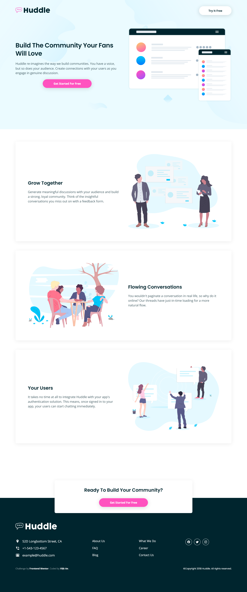
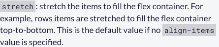

# Frontend Mentor - Huddle landing page with alternating feature blocks solution

This is a solution to the [Huddle landing page with alternating feature blocks challenge on Frontend Mentor](https://www.frontendmentor.io/challenges/huddle-landing-page-with-alternating-feature-blocks-5ca5f5981e82137ec91a5100). Frontend Mentor challenges help you improve your coding skills by building realistic projects.

## Table of contents

-   [Overview](#overview)
    -   [The challenge](#the-challenge)
    -   [Screenshot](#screenshot)
    -   [Links](#links)
-   [My process](#my-process)
    -   [Built with](#built-with)
    -   [What I learned](#what-i-learned)
-   [Author](#author)

## Overview

### The challenge

Users should be able to:

-   View the optimal layout for the site depending on their device's screen size
-   See hover states for all interactive elements on the page

### Screenshot



### Links

- [Live Website](https://vietan0.github.io/FM-huddle-landing-page-with-alternating-feature-blocks/)
- [Solution Page on Frontend Mentor](https://www.frontendmentor.io/solutions/huddle-landing-page-with-alternating-feature-blocks-2SyUG3Qvy)

## My process

### Structure

-   Header
    -   Logo
    -   Button
-   Main
    -   3 sections
    -   Hanging block
-   Footer
    -   Logo
    -   Footer links
    -   Attribution & Copyright

### Built with

-   Semantic HTML5 markup
-   CSS custom properties
-   Flexbox
-   CSS Grid
-   Mobile-first workflow

### What I learned

-   Two ways to scale `<svg>` element:

    -   [(Prefered) Control `<svg>` like an ``](https://stackoverflow.com/a/66051530/17673377)
    -   [Using viewBox](https://www.youtube.com/watch?v=TBYJ2V1jAlA)

-   Specify `align-items` to make sure flex items don't stretch ([freeCodeCamp](https://www.freecodecamp.org/learn/responsive-web-design/css-flexbox/align-elements-using-the-align-items-property)):
    
    

```css
.flex-container {
	align-items: /* anything but normal/stretch */ ;
}
```

-   Specify media queries **right after** each element - much easier to find afterwards

```css
section #hero {
	flex-direction: column;
}

@media (min-width: 800px) {
	section #hero {
		flex-direction: row;
	}
}

/* seperate element - seperate @media */

.thumbnail {
	object-fit: cover;
}

@media (min-width: 800px) {
	.thumbnail {
		object-fit: contain;
	}
}
```

## Author

-   Frontend Mentor - [@vietan0](https://www.frontendmentor.io/profile/vietan0)
-   Linkedin - [@vietan](https://www.linkedin.com/in/vietan/)
